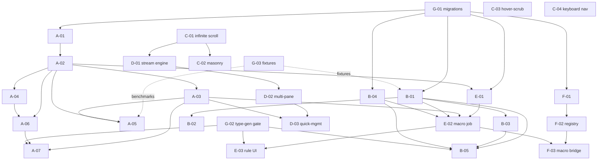

# Media Suite — Requirements & Task Backlog

Long-lived backlog for turning Spacedrive into an all-in-one media manager for a
20TB+ local library: efficient multi-pane preview, TikTok-style "wander" browsing,
whole-directory move/organize macros, custom scripting, media workflows (batch
transcode, streaming conversion, batch rotation), and tag-based management with
recursive folder inheritance.

Companion document: [EXTRACTION-MAP.md](EXTRACTION-MAP.md) (where reference code comes from).

## Document structure

Three levels of granularity:

1. **Overall goal** — the product outcome.
2. **Epics (A–G)** — one coherent capability area each, with a one-paragraph overview.
3. **Tasks** — bounded units with: scope, explicit non-goals, dependencies, and
   verifiable acceptance criteria. Each task is sized for a single agent/PR.

Task ID format: `EPIC-NN`. Dependencies reference other task IDs. The
[dependency & parallelism plan](#dependency--parallelism-plan) at the end groups
tasks into execution waves for a multi-agent team.

---

## Overall goal

Deliver, on the Spacedrive platform, a local-first media manager that lets one user
fluidly browse, preview, organize, tag, and transcode a 20TB library of video and
images, with recursive tag inheritance, scriptable organization macros, and a
multi-pane "wander" browsing mode — without rewriting Spacedrive's indexing, jobs,
storage, or sync foundations.

**Out of scope (platform-level, reused as-is):** indexing pipeline, job/checkpoint
system, volume/location management, device sync, the existing preview components,
and the core RPC/type-generation pipeline.

---

## Epic overview

| Epic | Title | Outcome | Primary surface |
|------|-------|---------|-----------------|
| **A** | Tag inheritance & hierarchy | Folder children inherit parent tags recursively, with per-item override; tag parents/siblings | Rust core + DB |
| **B** | Media transcode & streaming workflows | Generic transcode, HLS/DASH streaming output, GPU accel, batch rotation | Rust core + ffmpeg |
| **C** | High-performance browsing UI | Infinite scroll, masonry/justified view, in-grid video hover-scrub, keyboard nav | React frontend |
| **D** | Wander / multi-pane flow | TikTok-style auto-playing multi-pane feed with inline quick-management | React frontend |
| **E** | Organization macros & rules engine | Declarative condition→action rules for bulk move/tag/transcode | Rust core |
| **F** | Custom scripting (WASM) | Finish SDK so user Rust→WASM extensions can register jobs/actions | Rust core + SDK |
| **G** | Cross-cutting: schema, types, perf | Migrations, TS type-gen, caching, test harness shared by all epics | Rust + tooling |

---

## EPIC A — Tag inheritance & hierarchy

**Overview.** Spacedrive already has a semantic tag DAG with a closure table and
apply/search ops. This epic adds (1) recursive folder→child tag inheritance with
explicit override/removal, and (2) tag parent (implication) and sibling (synonym)
relations modeled after hydrus. Inheritance must be computed at query time over the
existing directory closure table — never materialized per file — so 20TB libraries
stay cheap to write.

### A-01 — Inheritance data model & migration
- **Scope:** Add a tag-application "source" concept: `Direct`, `Inherited`,
  `Overridden` (explicit removal of an otherwise-inherited tag). Create SeaORM
  migration(s); extend [core/src/domain/tag.rs](../../core/src/domain/tag.rs) and the
  user-metadata tag link.
- **Non-goals:** No query resolution logic, no UI.
- **Deps:** G-01.
- **Acceptance:** Migration applies and reverses cleanly; new enum/columns
  serialize; existing tag tests still pass; `cargo test` green.

### A-02 — Inheritance resolution query
- **Scope:** Given a file/folder, compute effective tags = own `Direct` ∪
  ancestors' `Inherited` − local `Overridden`, using the directory closure table
  (indexing Phase 4 output). Add a query op under
  [core/src/ops/tags/](../../core/src/ops/tags/).
- **Non-goals:** No write/propagation path (A-03), no caching (A-05).
- **Deps:** A-01.
- **Acceptance:** Unit tests cover: direct-only, single-level inherit, multi-level
  inherit, override-at-leaf, override-mid-tree, and re-add-after-override. Resolution
  for a file 6 levels deep returns correct set.

### A-03 — Apply/override actions
- **Scope:** Actions to (a) tag a folder so descendants inherit, (b) override/remove
  an inherited tag on a specific item, (c) clear an override. Extend
  [core/src/ops/tags/apply/action.rs](../../core/src/ops/tags/apply/action.rs).
- **Non-goals:** No bulk macro engine (Epic E).
- **Deps:** A-02.
- **Acceptance:** Applying a tag to a folder makes A-02 return it for all
  descendants; override hides it for one subtree only; actions are idempotent;
  covered by integration tests.

### A-04 — Tag parents (implication) & siblings (synonyms)
- **Scope:** Port hydrus implication-expansion
  (`reference/hydrus/.../ClientDBTagParents.py`) into
  [ancestors.rs](../../core/src/ops/tags/ancestors.rs); port sibling canonicalization
  (`ClientDBTagSiblings.py`) onto `TagRelationship::Synonym`. Parents/siblings expand
  at query time.
- **Non-goals:** No UI for editing relationships.
- **Deps:** A-02.
- **Acceptance:** Tagging "cat" makes searches for parent "animal" match; sibling
  "feline"≡"cat" collapse to one canonical tag in results; cycle detection prevents
  infinite expansion; unit-tested.

### A-05 — Effective-tag cache
- **Scope:** Add an in-memory/derived cache for resolved effective tags, invalidated
  on tag apply/override and on directory moves.
- **Non-goals:** No new persistence format.
- **Deps:** A-02, A-03, B-? (none). Independent of B.
- **Acceptance:** Repeated resolution of an unchanged subtree avoids recomputation
  (measured); cache invalidates correctly after A-03 actions and after a folder move;
  benchmark shows >10x speedup on a 10k-file subtree vs uncached.

### A-06 — Search integration for inherited tags
- **Scope:** Make [core/src/ops/search/filters.rs](../../core/src/ops/search/filters.rs)
  tag filter optionally include inherited tags, with a flag to distinguish
  owned-vs-inherited.
- **Deps:** A-02, A-04.
- **Acceptance:** Searching a tag returns files that inherit it; a toggle restricts to
  directly-tagged only; descendant expansion via closure table verified.

### A-07 — Frontend: inheritance indicators & override controls
- **Scope:** Show inherited vs direct tags distinctly in the tag UI; add
  override/clear controls. Regenerate TS types.
- **Deps:** A-03, A-06, G-02.
- **Acceptance:** UI displays inherited tags greyed/badged; user can override and
  clear; changes reflect after refetch; type-safe (no `as any`).

---

## EPIC B — Media transcode & streaming workflows

**Overview.** Generalize the H.264-only proxy system into a flexible transcode
engine, add HLS/DASH streaming output, vendor-neutral GPU acceleration (Vulkan), and
batch image rotation that writes pixels back. FFmpeg argument strings are lifted
verbatim from photoprism (GPU) and immich (HLS); wrappers are rewritten in Rust on
the existing job system.

### B-01 — Generic TranscodeJob
- **Scope:** New `core/src/ops/media/transcode/` modeled on
  [proxy/job.rs](../../core/src/ops/media/proxy/job.rs). Config enum for codec
  (H.264/HEVC/VP9/AV1), container, resolution, bitrate/CRF. Two-phase discovery +
  processing, resumable.
- **Non-goals:** No HLS (B-03), no GPU path (B-02).
- **Deps:** G-01.
- **Acceptance:** Transcodes a sample to each codec via CPU encoders; job resumes
  after interrupt mid-batch; progress reported; errors per-file don't abort batch;
  integration-tested with a fixture video.

### B-02 — Vendor-neutral GPU acceleration (Vulkan)
- **Scope:** Add `h264_vulkan` (and detect existing NVENC/QSV/AMD) path; port arg
  strings from `reference/photoprism/internal/ffmpeg/vulkan/`. Extend
  [proxy/hardware.rs](../../core/src/ops/media/proxy/hardware.rs) and the transcode
  generator.
- **Deps:** B-01.
- **Acceptance:** On a Vulkan-capable host, transcode uses GPU and is faster than CPU
  on the same clip; gracefully falls back to CPU when unavailable; HW path selected by
  detection, overridable by config.

### B-03 — HLS/DASH streaming job
- **Scope:** New `core/src/ops/media/streaming/` producing `.m3u8` + `.ts` segments
  (and optionally DASH), with a bitrate ladder. Lift FFmpeg HLS flags from immich
  services. Register output as a new sidecar kind.
- **Deps:** B-01.
- **Acceptance:** Produces a valid playlist that plays in the existing
  [VideoPlayer.tsx](../../packages/interface/src/components/QuickPreview/VideoPlayer.tsx)
  (or hls.js); segments seekable; multi-rate ladder generated; sidecar discoverable.

### B-04 — Batch image rotation job
- **Scope:** New `core/src/ops/media/rotate/`: 90° CW/CCW (and flips) writing rotated
  pixels back via [crates/images/src/handler.rs](../../crates/images/src/handler.rs),
  updating EXIF orientation; ICC profile preserved (photoprism `vips_icc.go` as
  correctness ref).
- **Deps:** G-01.
- **Acceptance:** Rotating a batch produces correctly oriented files; EXIF
  orientation normalized; ICC profile retained; thumbnails regenerate; resumable
  across interrupt.

### B-05 — Frontend: transcode/stream/rotate triggers & progress
- **Scope:** UI to launch B-01/B-03/B-04 on a selection, choose presets, and watch
  job progress. Regenerate TS types.
- **Deps:** B-01, B-03, B-04, G-02.
- **Acceptance:** User selects files, picks a preset, starts a job, sees live
  progress and completion; type-safe.

---

## EPIC C — High-performance browsing UI

**Overview.** Scale and enrich the explorer for 20TB: infinite scroll instead of the
1000-item cap, a justified/masonry view (`justified-layout` npm), in-grid video
hover-scrub over existing thumbstrip sprites, and keyboard-driven navigation.

### C-01 — Infinite scroll in explorer
- **Scope:** Convert [useExplorerFiles.ts](../../packages/interface/src/routes/explorer/hooks/useExplorerFiles.ts)
  to `useInfiniteQuery` against the search/listing ops (already support limit/offset).
- **Non-goals:** No new view yet.
- **Deps:** none (frontend-only).
- **Acceptance:** Scrolling a folder/search with >100k items loads pages on demand;
  memory stays bounded; virtualization preserved; no duplicate/missing rows.

### C-02 — Masonry/justified view
- **Scope:** New `MasonryView` using `justified-layout` (T1 npm); feed aspect ratios
  from media metadata; integrate with the virtualizer. Architecture referenced from
  immich timeline manager.
- **Deps:** C-01.
- **Acceptance:** Mixed-aspect images/videos render in justified rows with no
  cropping/overflow; smooth scroll at 60fps on a 50k-item set; resizing reflows.

### C-03 — In-grid video hover-scrub
- **Scope:** React hook driving CSS `background-position` over the existing
  thumbstrip sidecar; offset math ported from Video-Hub-App filmstrip (T2).
- **Deps:** none (uses existing sidecars). Can land in C-02 or GridView.
- **Acceptance:** Hovering a video tile scrubs through frames following cursor X;
  falls back to static frame when no thumbstrip; no layout shift.

### C-04 — Keyboard navigation & sequential preview
- **Scope:** Arrow-key navigation across the grid and within fullscreen preview
  (next/prev), building on [QuickPreview](../../packages/interface/src/components/QuickPreview/).
- **Deps:** none.
- **Acceptance:** ←/→ move selection and advance preview; Esc closes; focus
  management correct; works in Grid, Media, and Masonry views.

---

## EPIC D — Wander / multi-pane flow

**Overview.** A new browsing mode: N independent panes, each bound to a data source
(tag/folder/search), auto-playing images and muted looping videos like a TikTok
feed, with inline quick-management (tag/move/delete) wired to Epic A and existing
file ops. Reuses native preview/player components.

### D-01 — Wander data-stream engine
- **Scope:** Per-pane cursor + prefetch queue pulling from a source query
  (sequential or shuffled), with backpressure. Frontend state/store under
  `packages/interface/src/`.
- **Non-goals:** No layout yet.
- **Deps:** C-01 (paged fetching).
- **Acceptance:** A pane streams an endless ordered/shuffled sequence from a source;
  prefetch keeps next N ready; no stall on fast advance; bounded memory.

### D-02 — Multi-pane wander layout & autoplay
- **Scope:** New `/wander` route + `WanderView`: configurable grid of panes, each
  rendering via existing image renderer / VideoPlayer (muted, looping), auto-advance
  timers, per-pane play/pause.
- **Deps:** D-01.
- **Acceptance:** Multiple panes play simultaneously without audio overlap; images
  advance on timer, videos loop then advance; performant with 4–9 panes; pane sources
  independently configurable.

### D-03 — Inline quick-management overlay
- **Scope:** Hover/focus overlay per pane: quick-tag (Epic A actions), move, delete,
  favorite — calling existing file ops and A-03.
- **Deps:** D-02, A-03.
- **Acceptance:** Acting on a pane's current item tags/moves/deletes it and advances;
  actions are undoable where the underlying op supports it; reflects in library after
  refetch.

---

## EPIC E — Organization macros & rules engine

**Overview.** A declarative rules engine: `condition (tag/type/path/metadata) →
action (move/tag/transcode/rotate)`, executed as batch jobs. Short-term uses
JSON/TOML rule definitions (no WASM dependency); composes the existing job system and
Epic A/B actions.

### E-01 — Rule schema & evaluator
- **Scope:** Define rule domain object (conditions over tag/type/path/size/metadata;
  actions referencing existing ops). Parser + evaluator in
  `core/src/ops/` (new module). Declarative TOML/JSON.
- **Non-goals:** No execution/scheduling yet.
- **Deps:** A-02 (tag conditions), G-01.
- **Acceptance:** Rules parse and validate; evaluator selects the correct file set for
  representative rules; malformed rules rejected with clear errors; unit-tested.

### E-02 — Macro execution job
- **Scope:** A job that runs a rule set, dispatching the referenced actions
  (move/tag/transcode/rotate) in batches, resumable, with a dry-run/preview mode.
- **Deps:** E-01, A-03, B-01, B-04.
- **Acceptance:** Dry-run reports planned changes without mutating; real run performs
  them; resumable mid-batch; per-item failures logged and skipped.

### E-03 — Frontend: rule builder & run
- **Scope:** UI to compose rules, preview matches (dry-run), and execute. Regenerate
  TS types.
- **Deps:** E-02, G-02.
- **Acceptance:** User builds a rule, sees matched files, runs dry-run then commit,
  watches job progress; type-safe.

---

## EPIC F — Custom scripting (WASM)

**Overview.** The SDK (`crates/sdk`, `crates/sdk-macros`) and a test extension exist,
but the **core does not yet load/execute WASM modules**. This epic completes that so
users can write Rust→WASM extensions that register jobs/actions — the long-term path
for "custom scripts/macros." Lower priority; unblocks advanced E-* scripting.

### F-01 — WASM module loader & host bindings
- **Scope:** Implement core-side loading, instantiation, and host-function binding for
  `.wasm` extensions per the SDK FFI (`crates/sdk/`). Sandbox + capability checks.
- **Deps:** G-01.
- **Acceptance:** The existing [test-extension](../../extensions/test-extension/)
  loads, its counter job runs to completion with checkpointing, and is interrupt/
  resume-safe; failures are sandbox-contained.

### F-02 — Extension-registered jobs/actions in the registry
- **Scope:** Surface WASM-defined jobs/actions through the operation registry so they
  appear alongside native ops and are invokable from the frontend.
- **Deps:** F-01.
- **Acceptance:** A test extension action is listed and invokable via the normal
  RPC/hooks path; type metadata exposed; isolated from core failures.

### F-03 — Macro engine → WASM bridge (optional)
- **Scope:** Allow Epic E rules to call WASM-defined actions.
- **Deps:** F-02, E-02.
- **Acceptance:** A rule references a WASM action and executes it within a macro run.

---

## EPIC G — Cross-cutting foundations

**Overview.** Shared enablers every epic depends on: migration scaffolding, the TS
type-generation gate, perf benchmarks, and test fixtures.

### G-01 — Migration & schema scaffolding
- **Scope:** Establish the migration pattern/baseline for new tables/columns
  (inheritance, rules, sidecar kinds) so epics add migrations consistently.
- **Deps:** none.
- **Acceptance:** A no-op sample migration applies/reverses in CI; documented pattern;
  `cargo test` green.

### G-02 — TS type-generation gate
- **Scope:** Ensure `cargo run --bin generate_typescript_types` is part of the
  workflow and CI fails if generated types drift from Rust.
- **Deps:** none.
- **Acceptance:** Changing a `Type`-deriving struct without regenerating fails CI;
  regenerating passes; documented in AGENTS workflow.

### G-03 — Media test fixtures & benchmark harness
- **Scope:** Curated small fixtures (images of varied aspect/EXIF/ICC, short clips in
  several codecs) + a benchmark harness for transcode/rotate/tag-resolution.
- **Deps:** none.
- **Acceptance:** Fixtures committed (or generated); benchmarks runnable locally and
  produce comparable numbers for B-*, A-05.

---

## Dependency & parallelism plan

### Dependency graph

### Critical path

`G-01 → A-01 → A-02 → A-03 → (A-05 / A-06 / D-03 / E-02)`. Tag inheritance is the
longest serial chain and the differentiating feature — staff it first and deepest.

### Execution waves (for a multi-agent team)

Each wave lists tasks that can run **in parallel** because their dependencies are
satisfied by earlier waves. Assign one agent per task; tasks in the same wave share no
files except via the G-* contracts.

| Wave | Parallel tasks | Notes |
|------|----------------|-------|
| **0 (foundations)** | G-01, G-02, G-03, C-01, C-03, C-04 | G-* unblock everyone; the frontend C tasks are independent and need no backend. |
| **1** | A-01, B-01, B-04, E-01*, F-01, C-02 | E-01 needs A-02 for tag conditions — start its non-tag scaffolding now, gate tag conditions on Wave 2. B/F/C run fully parallel. |
| **2** | A-02, B-02, B-03, D-01, F-02 | A-02 unblocks the whole tag tree; B-02/B-03 extend transcode; D-01 needs C-01 (done). |
| **3** | A-03, A-04, A-05, B-05, D-02, E-01 (finish) | Tag write/relations/cache in parallel; transcode UI; wander layout. |
| **4** | A-06, A-07, D-03, E-02, F-03 | Search+UI for tags; quick-management; macro execution; WASM bridge. |
| **5** | E-03, final integration & perf pass | Rule UI; end-to-end wander+macro+tag validation on a large fixture set. |

### Parallelism rules of engagement

- **Backend vs frontend split:** Epic C/D frontend tasks (except those marked
  needing A-03/B-* APIs) can proceed against mocked types from day one; integrate once
  G-02 + the relevant backend action lands.
- **File-ownership boundaries:** A-* touches `core/src/ops/tags/` + `domain/tag.rs`;
  B-* touches `core/src/ops/media/`; E-* a new `core/src/ops/rules/` (or similar);
  C-*/D-* touch `packages/interface/`. Cross-epic edits only flow through G-01
  migrations and G-02 generated types — keep those changes small and reviewed.
- **Never** start a task whose deps are unmet; if blocked, pick another same-wave task.
- Every backend task that changes a `Type`-deriving struct must run G-02 type-gen
  before the matching frontend task starts.

### Acceptance gate for "done"

The suite is complete when, on a representative multi-TB fixture library: tags
inherit recursively with working overrides (Epic A); batch transcode/HLS/rotate jobs
run and resume (Epic B); the explorer scrolls infinitely with masonry + hover-scrub
(Epic C); wander plays multi-pane with inline management (Epic D); a rule macro
dry-runs and executes a bulk reorganize (Epic E); and at least the test WASM
extension registers and runs an action (Epic F) — all type-safe and `cargo test`
green.
